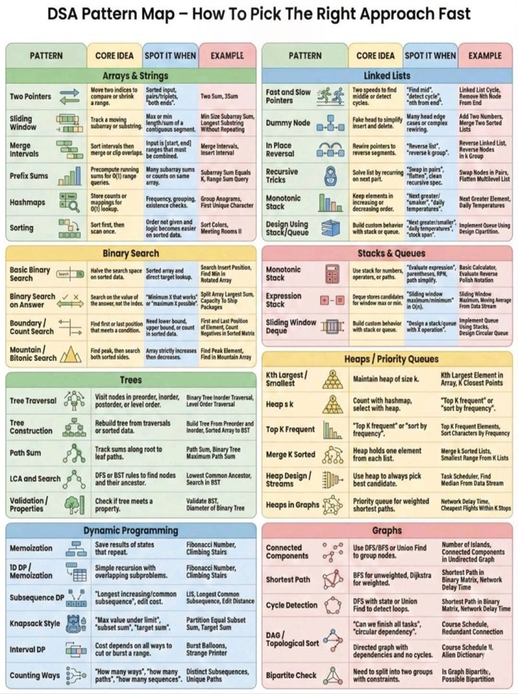
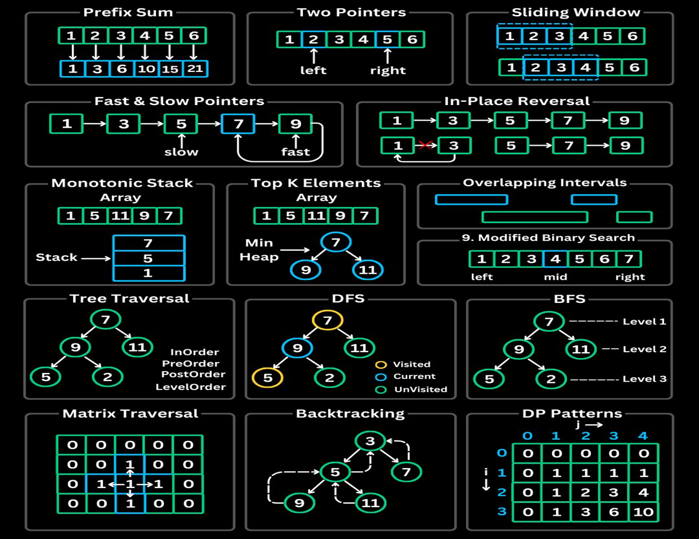

# 🚀 Data Structures & Algorithms

A comprehensive and structured collection of Data Structures and Algorithms implementations in:

- C
- Java
- Python

This repository is designed for:
- Technical interview preparation
- Competitive programming
- Strengthening core problem-solving skills
- Writing optimized and clean implementations

---

## 🧠 Topics Covered

### 🔹 Fundamentals
- Arrays
- Strings
- Recursion
- Bit Manipulation
- Mathematics

### 🔹 Linear Data Structures
- Linked List (Singly / Doubly / Circular)
- Stack
- Queue
- Deque

### 🔹 Searching & Sorting
- Linear Search
- Binary Search
- Bubble Sort
- Selection Sort
- Insertion Sort
- Merge Sort
- Quick Sort
- Heap Sort

### 🔹 Hashing
- Hash Tables
- Collision Handling
- Frequency Counting
- Sliding Window

### 🌳 Trees
- Binary Tree
- Binary Search Tree
- Tree Traversals (DFS / BFS)
- AVL Tree
- Heap
- Trie

### 🔗 Graphs
- Representation (Adjacency List / Matrix)
- BFS
- DFS
- Topological Sort
- Dijkstra’s Algorithm
- Bellman-Ford
- Floyd Warshall
- Minimum Spanning Tree (Prim’s / Kruskal’s)
- Disjoint Set (Union-Find)

### ⚡ Advanced
- Dynamic Programming
- Greedy Algorithms
- Backtracking
- Divide and Conquer
- Two Pointer Technique
- Sliding Window
- Monotonic Stack
- Segment Tree
- Binary Indexed Tree (Fenwick Tree)

---
## 🧩 patterns



---
## 🧠 Problem Format
Each problem solution typically contains:
- Clear problem statement
- Brute force approach
- Optimized approach
- Time complexity
- Space complexity
- Edge case discussion
- Time Complexity: `O(...)`
- Space Complexity: `O(...)`

Optimized solutions are preferred over brute force.

---

## 🚀 Getting Started

Clone the repository:

```bash
git clone https://github.com/coded-by-bubai/DSA.git
```

Move into the project directory:

```bash
cd DSA
```

---

## ▶ Running Code

### C

```bash
gcc filename.c -o output
./output
```

### Java

```bash
javac Filename.java
java Filename
```

### Python

```bash
python filename.py
```

---

## 🎯 Goals of This Repository

- Master core data structures
- Understand algorithmic patterns
- Improve problem-solving speed
- Write clean, readable, and optimized code
- Prepare for technical interviews at top companies

---

## 📈 Practice Sources

Problems are practiced from:
- LeetCode
- GeeksforGeeks
- CodeStudio
- HackerRank
- Codeforces

---

## 🤝 Contributions

Contributions are welcome.

1. Fork the repository
2. Create a new branch
3. Add optimized solutions or improvements
4. Submit a Pull Request

---

## ⭐ Support

If you find this repository useful, consider giving it a star.

---

## 📬 Contact

Open an issue for discussion, improvements, or suggestions.
