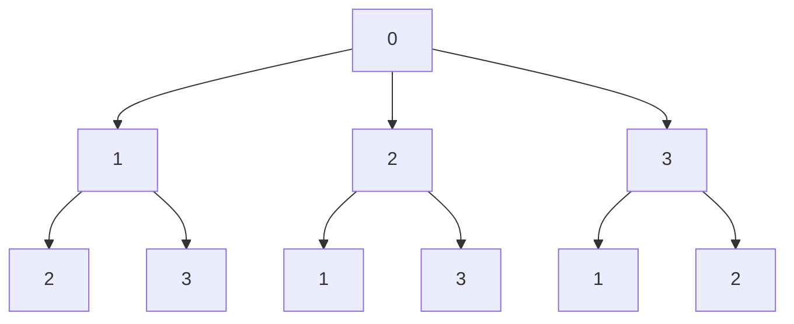

# 🚀 Travelling Salesman Problem (TSP) – C Implementation


-red.svg)


---

## 📌 Overview

This project implements the **Travelling Salesman Problem (TSP)** using the **Backtracking (Brute Force)** approach in C.

The program:

- Accepts number of cities (less than 10)
- Takes cost adjacency matrix as input
- Calculates minimum travelling cost
- Prints optimal path
- Visits each city exactly once
- Returns to starting city

---

## 🧠 Problem Statement

Given `n` cities and a cost matrix representing the distance between every pair of cities, determine the shortest possible route that:

- Visits each city exactly once  
- Returns to the starting city  
- Minimizes total travel cost  

TSP is a classic **NP-Hard combinatorial optimization problem**.

---

## ⚙️ Algorithm Used

This implementation uses **Backtracking (Brute Force)**.

### Core Idea

1. Fix starting city as `0`
2. Recursively visit all unvisited cities
3. Maintain current path and accumulated cost
4. When all cities are visited:
   - Add cost to return to start
   - Update minimum cost if smaller
5. Backtrack and explore other permutations

---

## 🔄 Algorithm Flow Diagram

### 🔹 Overall Flow

```mermaid
flowchart TD
    A[Start] --> B[Input number of cities]
    B --> C[Input cost matrix]
    C --> D[Mark city 0 visited]
    D --> E[Call tsp(0,1,0)]
    E --> F{All cities visited?}
    F -- Yes --> G[Add return cost]
    G --> H[Update minimum cost]
    F -- No --> I[Try next unvisited city]
    I --> E
    H --> J[Backtrack]
    J --> I
```

---

### 🔹 Recursive Exploration Tree (Conceptual)



Each leaf node represents a complete tour.

---

## 📊 Complexity Analysis

### ⏱ Time Complexity

Number of possible tours:

```
(n - 1)!
```

Overall complexity:

```
O(n!)
```

Factorial growth makes this solution impractical for large `n`.

---

### 💾 Space Complexity

```
O(n)
```

Used for:
- Visited array
- Path array
- Recursion stack

---

## 🖥 How to Compile and Run

### Compile

```bash
gcc tsp.c -o tsp
```

### Run

```bash
./tsp
```

---

## 🧪 Sample Input

```
Enter number of city (Enter < 10): 4

0 10 15 20
10 0 35 25
15 35 0 30
20 25 30 0
```

---

## ✅ Sample Output

```
Minimum cost is: 80
Optimal Path: 0 -> 1 -> 3 -> 2 -> 0
```

---

## ✨ Features

- Adjacency matrix representation
- Recursion with backtracking
- Optimal path storage
- Prevents revisiting cities
- Validates return path to starting city
- Clean and readable implementation

---

## ⚠️ Limitations

- Suitable only for small inputs (recommended < 10 cities)
- Exponential time complexity
- No pruning optimization
- Not scalable for real-world large datasets

---

## 🚀 Future Improvements

- Implement Branch and Bound
- Use Dynamic Programming (Held-Karp algorithm)
- Add pruning to reduce unnecessary recursive calls
- Accept city names instead of numeric indices
- Add graphical visualization

---

## 📚 Concepts Covered

- Recursion
- Backtracking
- Graph Representation (Adjacency Matrix)
- Hamiltonian Cycle
- NP-Hard Problems
- Combinatorial Optimization

---

## 📄 License

This project is licensed under the MIT License.